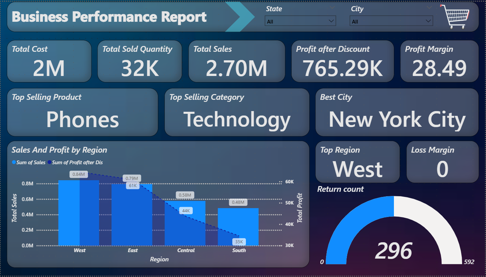
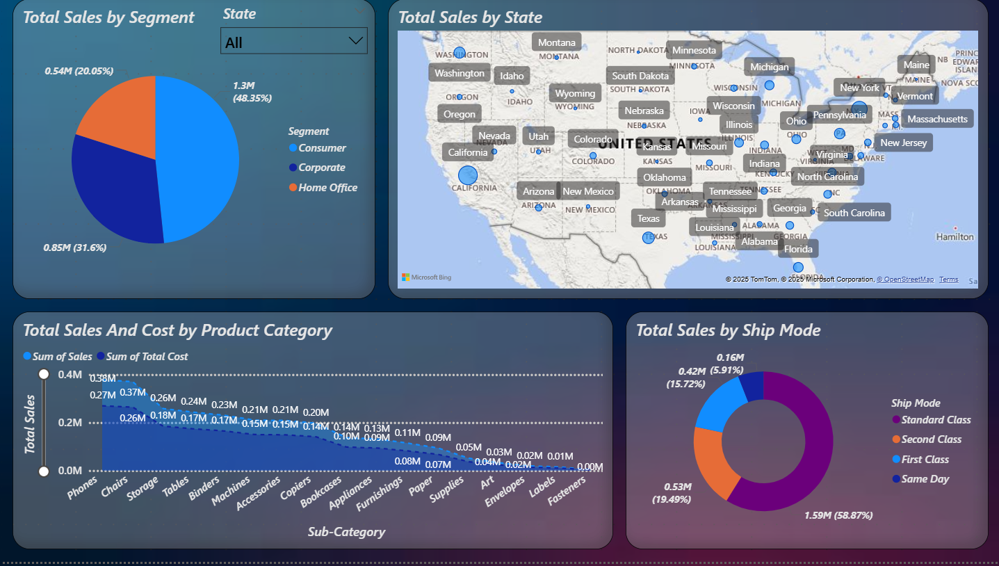
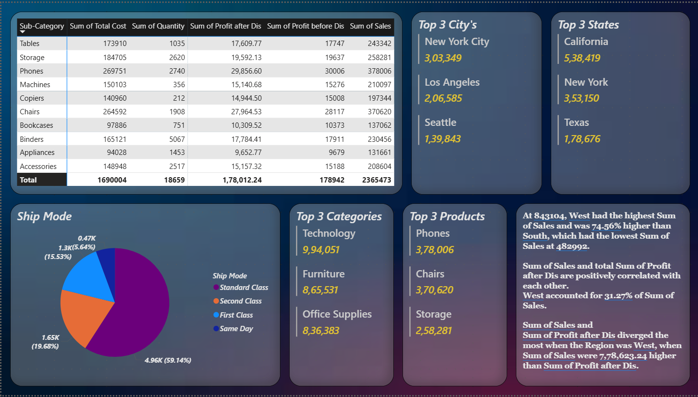

# 📊 Business Performance Report Dashboard

This Power BI Dashboard presents a comprehensive **Business Performance Report** with a detailed analysis of sales, profit, cost, and quantity across product sub-categories, states, cities, and shipping methods. The dashboard is designed to support strategic decisions with interactive and visually rich insights.



---

## 📁 Project Structure

```
📦 Business-Performance-Dashboard
├── main.png      # Sub-Category Metrics Table
│── map.png      # Top Categories, Products, Cities, States
|── insights.png      # Ship Mode Distribution & Key Insights
├── README.md                 # Project Documentation
|──Dataset.xlsx      # Dataset
└── Business Analysis.pbix    # Power BI Dashboard File
```

---

## 📌 Key Visuals

### 🔹 1. Sub-Category Metrics Table
- Comparative view of **Total Cost**, **Quantity**, **Profit Before/After Discount**, and **Sales** for each sub-category.
- Helps identify which product lines are most/least profitable.


---

### 🔹 2. Top Categories, Products, Cities, States
- Highlights best-performing:
  - **Categories**: Technology, Furniture, Office Supplies
  - **Products**: Phones, Chairs, Storage
  - **Cities**: New York City, Los Angeles, Seattle
  - **States**: California, New York, Texas



---

### 🔹 3. Ship Mode & Executive Insights
- **Pie chart** showing shipping mode preferences (Standard Class is the most used).
- **Key insights** derived from data:
  - West region has highest sales (~8.43L INR)
  - Sales-Profit correlation is positive
  - West contributes over **31%** of total sales
  - Divergence identified where Sales outpaced Profit in the West



---

## 🛠️ Built With
- [Power BI](https://powerbi.microsoft.com/) – For data modeling and dashboards
- Microsoft Excel – Source dataset
- DAX – For calculated measures and KPIs

---

## 📈 Purpose
This dashboard enables business users to:
- Track profitability and sales performance
- Spot trends by region and product
- Evaluate shipping method usage
- Drive informed business decisions

---

## 🚀 Getting Started

1. Clone the repository:
```bash
git clone https://github.com/your-username/business-performance-dashboard.git
```
2. Open `Business Analysis.pbix` using Power BI Desktop.
3. Refresh data or customize visuals as needed.

---

## 📬 Contact
For feedback, collaboration, or questions:

**Sanjay S**  
📧 your.email@example.com  
👤 [LinkedIn Profile](https://www.linkedin.com/in/sanjays-953925)
👤 [Portfolio]()

---

## ✨ Credits
Made with ❤️ by **Sanjay S** using Power BI.

---
